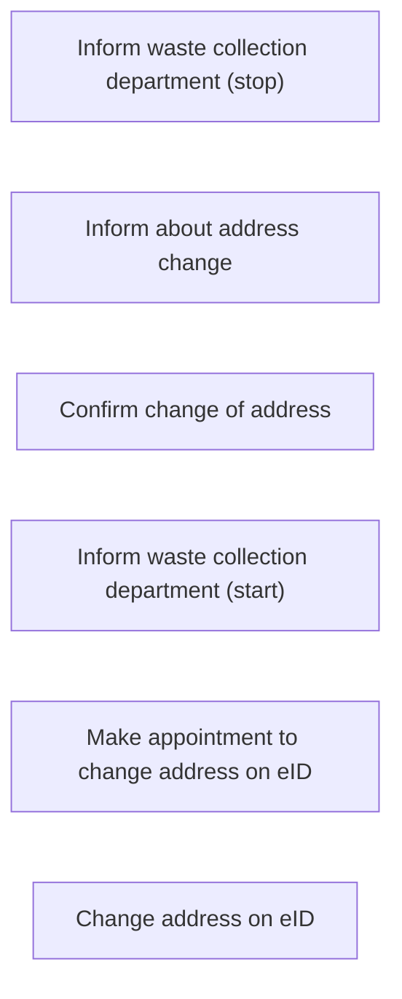

According to deliverable 1.1, and a [list](https://docs.google.com/spreadsheets/d/1Iw6w3Espwbw-tIvofDcL7SwahDAh7Hf3VDcaod190r0/edit#gid=836388458) 
provided by internet architects, the following steps (and sub-steps) where identified:

## Change address


different criteria were identifeid for each step, for which we provide steps.
[Steps regarding change of address](./change-address.ttl).

## Examples

The following example shows the definition of certain data, a shape for it, the definition of the step producing the data and a concrete execution of the step producing data.

```

#
# Definition of data
#
state:numberOf40LiterGreenWasteContainers a p-plan:Variable ;
  rdfs:label "Number of 40 liter green waste containers"@en ;
  rdfs:label "Aantal 40 liter GFT containers"@nl .

#
# The step producing this data (low level)
#
step:provideNumberOf40LiterGreenWasteContainersManually a o-steps:Step ;
  rdfs:label "Number of 40 liter green waste container(s)"@en ;
  rdfs:label "Aantal 40 liter GFT container(s)"@nl ;
  p-plan:hasOutputVar state:numberOf40LiterGreenWasteContainers .

#
# An execution of the step
#
app:providedNumberOf40LiterGreyWasteContainerSven o-steps:ExecutedStep ;
    p-plan:correspondstoStep step:provideNumberOf40LiterGreenWasteContainersManually ;
    prov:generated app:greenWasteContainerAmount40Sven .

#
# The actual data produced by the execution of the step
#
app:greenWasteContainerAmount40Sven a prov:Entity, cccev:RequirementResponse ;
    p-plan:correspondsToVariable state:numberOf40LiterGreenWasteContainers ;
    cccev:value 3 .

#
# The shape stating which step OUTPUT is valid (targeting data definition)
# Target the data definition and go via inverse path to corresponding responses and check cccev:value which needs to be either 0, 1, 2 or 3
#
shape:greenWasteContainer40LiterConstraints a sh:NodeShape ;
    sh:targetNode state:numberOf40LiterGreenWasteContainers ;
    sh:property [
        sh:path ( 
            [ sh:inversePath p-plan:correspondsToVariable ]
            cccev:value
        );
        sh:in (0 1 2 3) ;
    ] .

```
