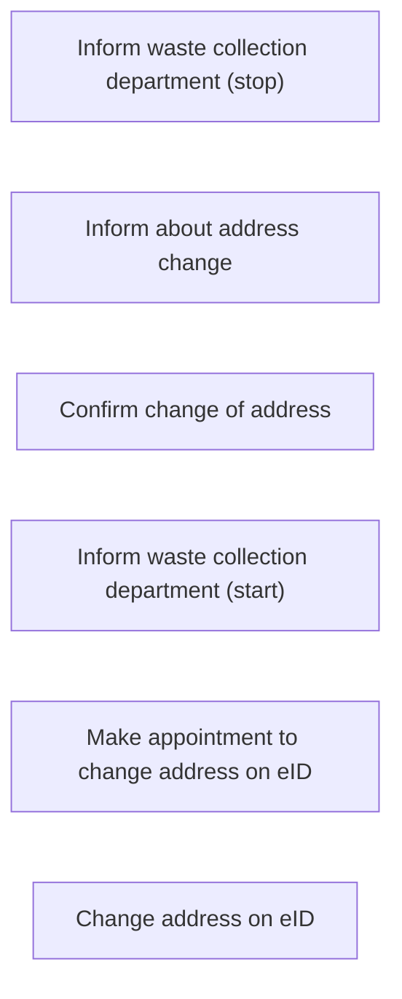

According to deliverable 1.1, and a [list](https://docs.google.com/spreadsheets/d/1Iw6w3Espwbw-tIvofDcL7SwahDAh7Hf3VDcaod190r0/edit#gid=836388458) 
provided by internet architects, the following steps (and sub-steps) where identified:

## Change address

different criteria were identifeid for each step, for which we provide steps.
[Steps regarding change of address](./change-address.ttl).
